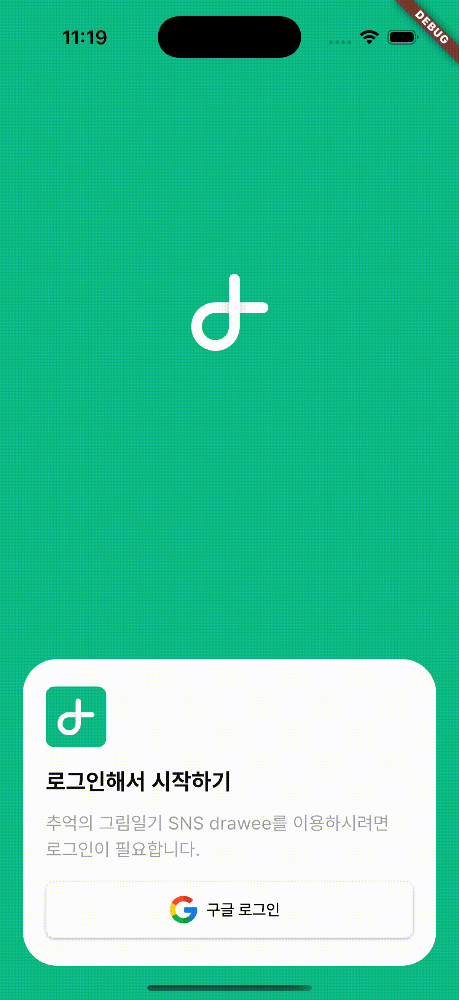

<div align="center">
  
</div>
<br>
<br>

# 📖 프로젝트 소개

방학숙제로 그림 일기 그려서 제출했던 것 기억하시나요? drawee는 그림 일기를 공유하는 SNS 입니다.

drawee는 사용자가 매일 주어지는 공통 주제에 따라 그림과 글로 개인적인 기억을 기록하고, 이를 꾸미고 공유할 수 있는 소셜 네트워크 서비스입니다. 사용자들은 자신만의 창의적인 방식으로 이야기를 풀어나가며, 서로의 그림일기에 좋아요를 보내거나, 댓글을 남기는 등의 방식으로 교류할 수 있습니다.

<br>

# 📂 프로젝트 기능

- 구글 로그인: 구글 계정으로 간편하게 회원가입 및 로그인을 할 수 있습니다.

- 공통 주제 제공: 매일 새롭게 제공되는 주제에 맞추어 글과 그림을 작성할 수 있습니다.

- 날씨별 그림일기: 서로 다른 유저가 작성한 그림일기들 중 같은 날씨끼리 모아서 확인해 볼 수 있습니다.

- 주제별 그림일기: 매일 새롭게 제공되는 주제 뿐만 아니라, 아카이빙 되어 있는 기존 주제별로 그림일기를 모아 볼 수 있습니다. 검색 기능을 활용합니다.

- 그림 꾸미기: 사용자가 직접 그린 그림에 낙서, 페인팅, 이모지 스티커 등등을 활용해 꾸미기가 가능합니다.

- 기록 및 공유: 완성된 그림 일기를 저장하고 다른 사용자들과 공유할 수 있습니다.

- 소셜 네트워크 기능: 다른 사용자의 작품을 감상하고, 댓글이나 좋아요를 통해 소통할 수 있습니다.

<br>

# 🚀 프로젝트에 사용된 기술

- 프로그래밍 언어: Dart + 약간의 JavaScript (Algolia)

- 프레임워크: Flutter

- 검색 기능: Algolia

- 데이터베이스: Firestore

- 아키텍처: Clean Architecture (Presentation, Domain, Data Layer 분리)

<br>

# 🏛️ 프로젝트 구조

```
├── add_mock_data.dart                                         # 앱 구동 테스트 위한 가짜 데이터 생성
├── constant                                                   # 앱 컬러 코드 등을 설정
│   ├── colors.dart
│   └── text_pattern.dart
├── core                                                       # 파이어베이스 설정
│   └── utils
│       └── firestore_utils.dart
├── data                                                       # 데이터
│   ├── data_sources                                           # data/data_sources
│   │   ├── algolia_subject_data_source.dart
│   │   ├── auth_data_source.dart
│   │   ├── firebase_auth_data_source.dart
│   │   ├── firebase_post_data_source.dart
│   │   ├── firebase_recommend_subject_data_source.dart
│   │   ├── firebase_user_data_source.dart
│   │   ├── post_data_source.dart
│   │   ├── recommend_subject_data_source.dart
│   │   ├── subject_data_source.dart
│   │   └── user_data_source.dart
│   ├── dto                                                     # data/dto
│   │   ├── post_dto.dart
│   │   ├── recommend_subject_dto.dart
│   │   ├── subject_dto.dart
│   │   └── user_dto.dart
│   └── repositories                                            # data/repositories
│       ├── auth_repository_impl.dart
│       ├── post_repository_impl.dart
│       ├── recommend_subject_repository_impl.dart
│       ├── subject_repository_impl.dart
│       └── user_repository_impl.dart
├── domain                                                      # 도메인
│   ├── entities                                                # domain/entities
│   │   ├── post.dart
│   │   ├── recommend_subject.dart
│   │   ├── subject.dart
│   │   └── user.dart
│   ├── repositories                                            # domain/repositories
│   │   ├── auth_repository.dart
│   │   ├── post_repository.dart
│   │   ├── recommend_subject_repository.dart
│   │   ├── subject_repository.dart
│   │   └── user_repository.dart
│   └── usecases                                                # domain/usecases
│       ├── auth                                                # auth 사용자 인증
│       │   └── sign_in_google_usecase.dart
│       ├── post                                                # post 그림일기 포스트
│       │   ├── create_post_usecase.dart
│       │   ├── delete_post_usecase.dart
│       │   ├── get_post_usecase.dart
│       │   ├── get_posts_by_subject_id_usecase.dart
│       │   ├── get_posts_by_user_id_usecase.dart
│       │   ├── get_posts_by_weather_usecase.dart
│       │   ├── get_posts_usecase.dart
│       │   └── update_post_usecase.dart
│       ├── recommend_subject                                   # 추천 주제
│       │   └── get_recommend_subject_usecase.dart
│       ├── subject                                             # 주제 관련
│       │   ├── get_subject_usecase.dart
│       │   └── get_subjects_usecase.dart
│       └── user                                                # 유저 관련
│           ├── create_user_usecase.dart
│           ├── delete_user_usecase.dart
│           ├── get_user_usecase.dart
│           └── update_user_usecase.dart
├── firebase_options.dart
├── main.dart
└── presentation                                                # 프레젠테이션 레이어
    ├── providers                                               # 프로바이더 모음
    │   ├── auth_providers.dart
    │   ├── post_providers.dart
    │   ├── recommend_subject_providers.dart
    │   ├── subject_providers.dart
    │   └── user_providers.dart
    ├── ui                                                       # ui 화면
    │   ├── home                                                 # 앱의 첫 진입점, 홈화면
    │   │   ├── home_page.dart
    │   │   └── widgets
    │   │       └── weather_box.dart
    │   ├── layout
    │   │   └── main_layout.dart
    │   ├── login                                                # 로그인 화면
    │   │   └── login_page.dart
    │   ├── mypage                                               # 마이페이지
    │   │   └── mypage_page.dart
    │   ├── register                                             # 회원 가입
    │   │   └── register_page.dart
    │   ├── splash                                               # 스플래쉬 화면
    │   │   └── splash_page.dart
    │   ├── subject_post                                         # 주제별 렌더링
    │   │   └── subject_post_page.dart
    │   ├── subject_search                                       # 주제 검색
    │   │   └── subject_search_page.dart
    │   ├── weather_post                                         # 날씨별 렌더링
    │   │   └── weather_post_page.dart
    │   ├── widgets
    │   │   └── post_card.dart
    │   └── write_post                                           # 그림일기 작성
    │       ├── widgets
    │       │   ├── diary_input_field.dart
    │       │   ├── hint_text.dart
    │       │   ├── section_title.dart
    │       │   └── weather_button.dart
    │       ├── write_post_page.dart
    │       └── write_post_view_model.dart
    └── viewmodels                                               # 뷰모델 모음
        ├── auth_view_model.dart
        ├── post_view_model.dart
        ├── recommend_subject_view_model.dart
        ├── subject_view_model.dart
        └── user_view_model.dart

```

## 🛠️ 프로젝트 설치 및 실행 방법

## Git 저장소 클론

`$ git clone https://github.com/5GHS/drawee.git`
<br>
`$ cd drawee`

## 의존성 설치

`$ flutter pub get`

## Algolia 검색 기능을 위한 `.env` 파일 생성

루트 디렉토리에서 `.env` 파일 생성 후, 아래 내용을 붙여넣고 각각의 값을 입력하세요.

```
ALGOLIA_APP_ID=여기에 ID를 입력하세요.
ALGOLIA_API_KEY=여기에는 Key 값을 입력하세요.
```

## Firebase 설정

파이어베이스 프로젝트를 생성하고, Firestore를 활성화합니다. Storage도 필요합니다.

1. Firebase 콘솔에서 `GoogleService-Info.plist`를 다운받아서 `ios/Runner/` 아래에 추가합니다.
2. `google-services.json` 파일은 `android/app/` 아래에 추가합니다.

## 📸 앱 구동 영상

### 구글 로그인

<div align="center">
  
</div>

<br>
<br>

### 그림 일기 업로드 및 날씨별 게시글 확인

<div align="center">
  
</div>
